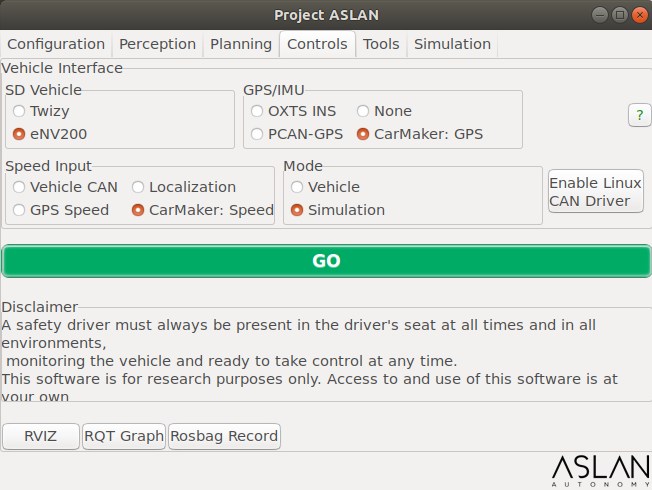
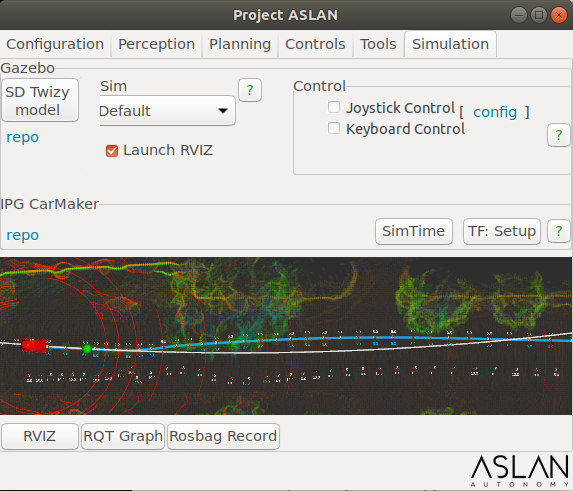
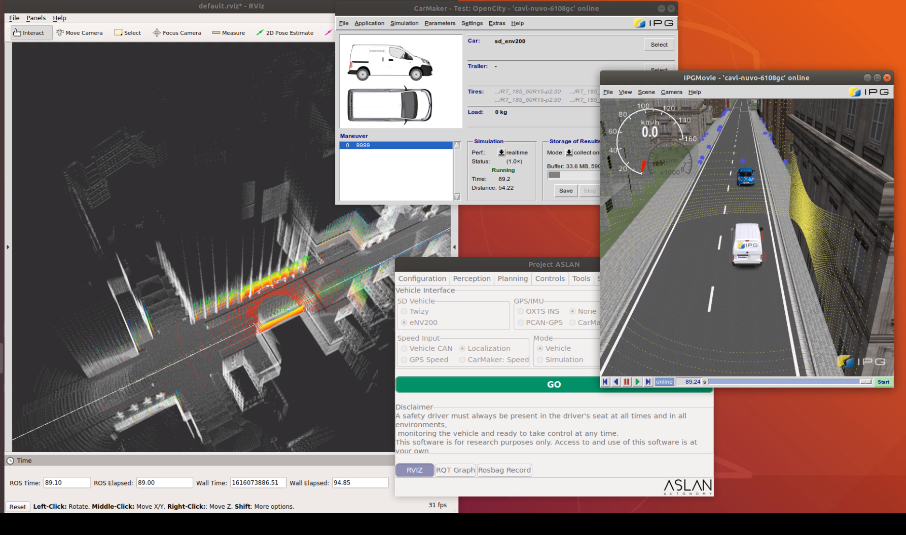

# Project Aslan

An open-source full-stack software based on [ROS framework](https://www.ros.org/about-ros/), for self-driving applications. Targeting to facilitate the research in
autonomous driving projects for low-speed applications in urban environments. This software comes with a built-in Gazebo based 
simulation, an end-to-end self-driving software and a user-friendly GUI to facilitate launching of the software.  
Used for trials on real-world automated vehicles. 

<p align="center"> 

</p>

<p align="center"> 

</p>

## Features and Deployment support:

- Graphics User Interface (GUI) with integrated ROS tools
- Docker and Source Code installation
- Multiple Sensors Drivers
- High level supervisor node, monitoring the heath of the system and publishing diagnostics
- Object Detection using LiDAR and Radar
- Emergency stop reaction
- Vehicle Interface acting as a bridge between ROS and the embedded vehicle controllers.
- PID/Feedforward linear velocity feedback loop
- Tunable yaw to steering percentage conversion map
- Integrated Gazebo simulation model
- 3 ways of simulation control: Aslan software, keyboard and joystick controllers
- Vehicle Models visualization and parameters description
- On-vehicle software testing and evaluation as well as parameters configuration
- Normal Distribution Transform (NDT)* for localization and mapping
- Voxel Grid and Ground Removal * point cloud filtering
- Route planning using waypoints *
- Path Planning based on A* Planner
- Comprehensive documentation of the source code in the repo and inside the GUI
- Online [tutorials](https://www.youtube.com/channel/UCnZLHdQ-KIL8RxWVrcbLSZg/videos)
- Quick start resources: [rosbag](https://www.dropbox.com/s/50tljbponc4euas/siliconosney.bag?dl=0), [point cloud map](https://www.dropbox.com/s/he2d1ax3em7bkis/siliconosney.pcd?dl=0) and [waypoints csv](https://www.dropbox.com/s/ys9c5stu5vo1bkr/siliconosney.csv?dl=0)

**Originally suggested at autoware.ai, tag: 1.10.0.  
These packages have been configured and modified significantly to fit the requirements of Project ASLAN.*   
Complete Feature Log, available [here](https://github.com/project-aslan/Aslan/blob/master/FEATURELOG.md)

## Recommended System

##### - Processor : Intel Core i7 or greater
##### - RAM size: 32G

## Requirements

##### - Ubuntu 18.04 LTS
##### - ROS Melodic [ros-melodic-desktop-full](http://wiki.ros.org/melodic/Installation/Ubuntu)
##### - Catkin Command Line Tools [catkin_tools](https://catkin-tools.readthedocs.io/en/latest/installing.html)


## Getting Started

### Installation

#### 1. Allow software updates
Search for Software & Updates and click on 'Other Software'.  
Tick the boxes allowing  software updates from 'canonical partners' and 'source code'.  
Press reload and enter your sudo password

#### 2. Install ROS Melodic Desktop Full
For more information please visit [here](http://wiki.ros.org/melodic/Installation/Ubuntu )

Setup your computer to accept software from packages.ros.org.
```
sudo sh -c 'echo "deb http://packages.ros.org/ros/ubuntu $(lsb_release -sc) main" > /etc/apt/sources.list.d/ros-latest.list'
```
Setup your keys
```
sudo apt-key adv --keyserver 'hkp://keyserver.ubuntu.com:80' --recv-key C1CF6E31E6BADE8868B172B4F42ED6FBAB17C654
```

Update debian package index
```
sudo apt-get update
```

Install ROS Melodic Desktop Full
```
sudo apt-get install ros-melodic-desktop-full
```

Set up your environment
```
echo "source /opt/ros/melodic/setup.bash" >> ~/.bashrc
source ~/.bashrc
```
Install additional tools
```
sudo apt install python-rosdep python-rosinstall python-rosinstall-generator python-wstool build-essential python-catkin-tools
```
Initialise rosdep
```
sudo rosdep init
rosdep update
```

#### 3. Clone the Project ASLAN repository with submodules

```
git clone --recurse-submodules https://github.com/project-aslan/Aslan.git

# if you haven't initialized and updated the submodules with --recurse-submodules when cloning, do:
cd Aslan/
git submodule update --init --recursive
```

#### 4. Install additional dependencies

```
cd Aslan
rosdep install -y --from-paths src --ignore-src --rosdistro $ROS_DISTRO
```
#### 5. Initialise your catkin workspace
```
catkin init
```

#### 6. Build your workspace
From the root of your catkin workspace, run

```
catkin_make
```

If you have previously built your workspace with catkin build:
Either clean your workspace with `catkin clean` and rebuild with `catkin_make`

## Running the software

To start the Project ASLAN GUI, simply execute the bash script:
```
./run
```

<p float="center">
  
   
  
</p>

## Contributing

Please take a moment to review the [Contribution Guidelines](https://github.com/project-aslan/Aslan/blob/master/CONTRIBUTING.md) in order to make the contribution process easy and effective. The issue tracker is the preferred channel for bug reports, feature requests and when working on new features implementation.

## Additional Resources
Project Aslan Dockerhub: [projaslan/aslan](https://hub.docker.com/r/projaslan/aslan)  

Project Aslan Website: [www.project-aslan.org](https://www.project-aslan.org/)

Quick Start Resources: [rosbag](https://www.dropbox.com/s/50tljbponc4euas/siliconosney.bag?dl=0), [point cloud map](https://www.dropbox.com/s/he2d1ax3em7bkis/siliconosney.pcd?dl=0) and [waypoints csv](https://www.dropbox.com/s/ys9c5stu5vo1bkr/siliconosney.csv?dl=0)

Online Tutorials: [Youtube Channel](https://www.youtube.com/channel/UCnZLHdQ-KIL8RxWVrcbLSZg/featured)

## Disclaimer
A dedicated, trained and attentive safety driver must always be present in the driver's seat at all times and in all environments, monitoring the vehicle.  
THIS SOFTWARE IS FOR RESEARCH PURPOSES ONLY. YOU ARE RESPONSIBLE FOR COMPLYING WITH LOCAL LAWS AND REGULATIONS. NO WARRANTY EXPRESSED OR IMPLIED. ACCESS TO AND USE OF THIS SOFTWARE IS AT YOUR OWN RISK AND RESPONSIBILITY.  

Project Aslan has been inspired by and was built on top of the Autoware Foundation’s open-source projects. In particular, a number of fundamental technologies have been adopted from Autoware.AI. With StreetDrone’s customisations for its electric vehicle and integration with other third-party drivers, Project Aslan immensely benefits from the Autoware’s projects and the Autoware Foundation members’ contributions.


## License

Aslan Software is licensed under [Apache 2 License](https://github.com/project-aslan/Aslan/blob/master/LICENSE)

