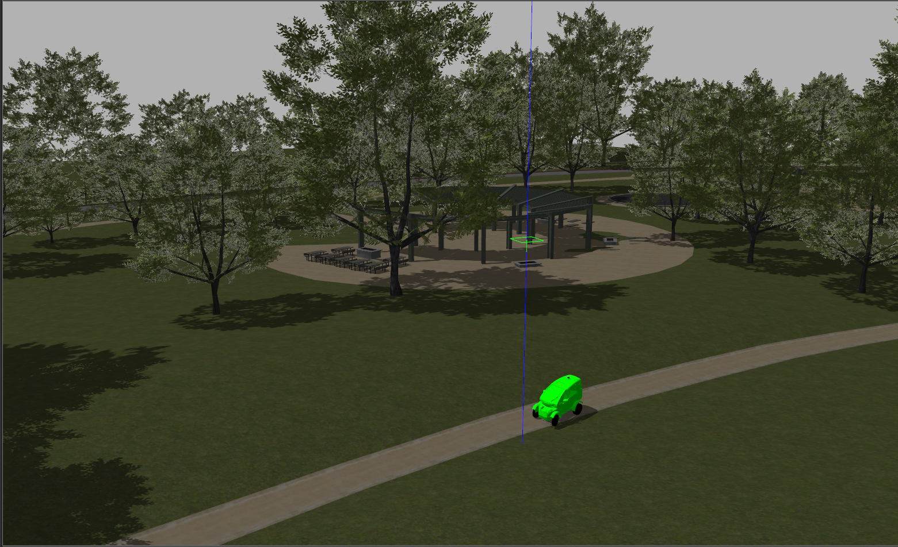
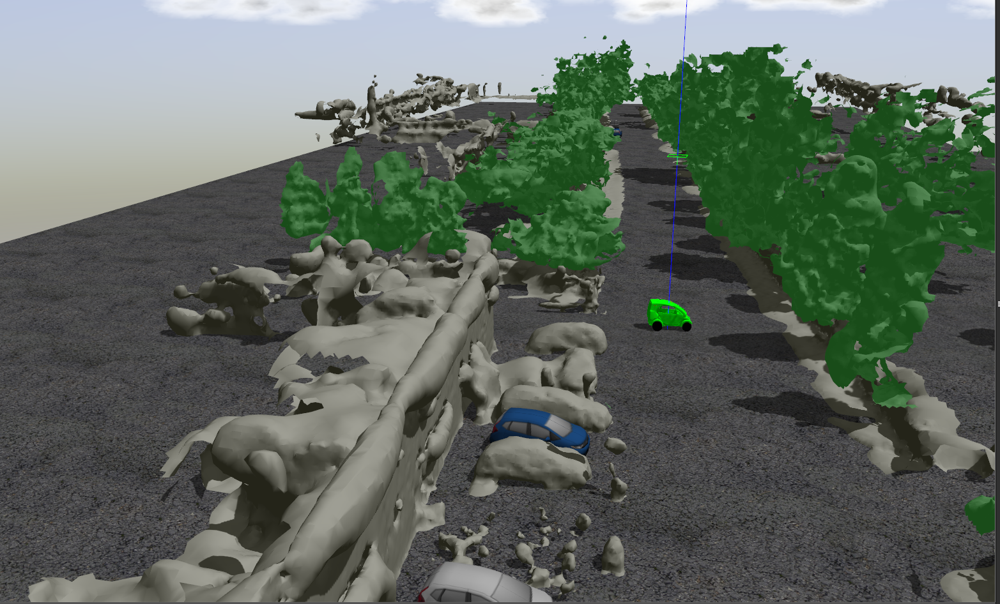

# sd_robot
This package contains the worlds and launch files for the SD Twizy Model.

### Launch
The package includes three different world configurations built using the default Gazebo models.
To launch the worlds:

`roslaunch sd_robot sd_twizy_worlds.launch` with arguments:

| arg         | values                         | default | description                                                               |
|-------------|--------------------------------|---------|---------------------------------------------------------------------------|
| enable_rviz | {true, false}                  | true    | Launch RVIZ alongside Gazebo (configuration: `config/sd_twizy_rviz.rviz`) |
| world       | {default, empty, park, shapes} | default | Gazebo world                                                              |

##### A. Default
A default enviroment with a vehicle only
```
roslaunch sd_robot sd_twizy_worlds.launch enable_rviz:=true world:=default
# OR roslaunch sd_robot sd_twizy_default.launch
```
<p align="center"> 

</p>

##### B. Shapes
An environment with a selection of static objects and buildings
```
roslaunch sd_robot sd_twizy_worlds.launch enable_rviz:=true world:=shapes
# OR roslaunch sd_robot sd_twizy_shapes.launch
```
<p align="center"> 

</p>

##### C. Park
A Parkland Environment
```
roslaunch sd_robot sd_twizy_worlds.launch enable_rviz:=true world:=park
# OR roslaunch sd_robot sd_twizy_park.launch
```
<p align="center"> 

</p>


##### D	. Osney
An Urban environment world, extracted from a lidar pointcloud
```
roslaunch sd_robot sd_twizy_worlds.launch enable_rviz:=true world:=silicon_osney
# OR roslaunch sd_robot sd_twizy_osney.launch
```
<p align="center"> 

</p>


